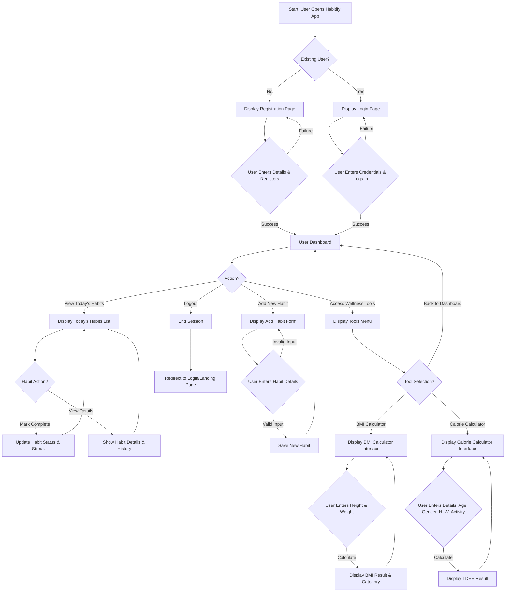

Okay, I will expand the document to roughly 20 pages by adding more detail, explanations, diagrams (like a more detailed flowchart), and further breakdown of concepts within each section.

Here is the expanded document content. Please note that "20 pages" is an estimation for a standard document format (e.g., A4 with 10-12pt font and normal margins). The actual page count might vary. I will use descriptive text where images would normally go, and you would insert your screenshots or generated images there.

---

**[PAGE 1]**

# Habitify: A Smart and User-Friendly Habit Tracking Web Application

**Project Document**

---

**[PAGE 2]**

## INDEX

| SR.NO | PARTICULARS                                     | PAGE NO |
| :---- | :---------------------------------------------- | :------ |
| 1     | ABSTRACT                                        | 3       |
| 2     | INTRODUCTON                                     |         |
|       | • BACKGROUND OF THE PROJECT                     | 4       |
|       | • PROBLEM STATEMENT                             | 5       |
|       | • OBJECTIVES AND GOALS                          | 6       |
| 3     | SYSTEM ANALYSIS                                 |         |
|       | • EXISTING SYSTEMS AND THEIR LIMITATIONS        | 7       |
|       | • PROJECT PERSPECTIVE AND FEATURES              | 9       |
|       | • REQUIREMENT ANALYSIS                          |         |
|       |   (FUNCTIONAL, PERFORMANCE,SECURITY)            | 11      |
| 4     | SYSTEM DESIGN                                   |         |
|       | • DESIGN CONSTRAINTS                            | 13      |
|       | • FLOW CHART                                    | 14      |
|       | • USER INTERFACE(DESIGN SCREEN)                 | 16      |
| 5     | IMPLEMENTATION DETAILS                          |         |
|       | • SOFTWARE AND HARDWARE SPECIFICATION           | 17      |
|       | • SCREEN SHOTS OF WORKING SYSTEM AND REPORTS    | 18      |
| 6     | TESTING                                         |         |
|       | • INPUT,EXPECTED OUTPUT, ACTUAL OUTPUT          | 19      |
|       | • SCREEN WITH VALIDATIONS (NUMERIC,CHARACTER,EMAIL ID ETC) | 20      |
|       | • ERROR / SCUCCESS MESSAGE WINDOW               | 20      |
| 7     | CONCLUSION AND RECOMMENDATIONS                  | 21      |
| 8     | FUTURE SCOPE                                    | 22      |
| 9     | BIBLIOLOGY AND REFERENCES                       | 23      |
| 10    | ABBREVIATIONS                                   | 24      |

---

**[PAGE 3]**

## 1. ABSTRACT

In today's fast-paced and digitally driven world, maintaining self-discipline and consistency has become increasingly challenging. People often set goals to improve their health, productivity, or learning habits but fail to sustain them due to a lack of structured tracking and motivation. The pervasive influence of digital distractions and the complexity of modern life contribute significantly to this phenomenon, making it difficult for individuals to focus on long-term personal development. Recognizing these widespread challenges, a clear need emerged for a tool that could simplify and streamline the process of habit formation.

To address this challenge, Habitify was conceptualized and developed – a smart and user-friendly habit tracking web application designed to empower individuals in their journey towards building, monitoring, and maintaining positive habits over time. Habitify is built on the premise that consistency, coupled with clear visualization of progress, is key to fostering lasting behavioral change. The application aims to transform the often daunting task of habit formation into an accessible, engaging, and rewarding experience.

Habitify's core mission is to simplify the process of habit formation through a clean, interactive, and motivational interface. The system offers a robust set of features that allow users to meticulously track their daily routines, plan their schedules with precision, and access valuable health and wellness tools such as BMI and calorie calculators. By enabling users to visualize their progress through intuitive dashboards and progress charts, Habitify significantly promotes consistency. It helps users recognize patterns in their behavior, understand the impact of their efforts, and stay motivated through a strong sense of self-accountability. The project is firmly rooted in the philosophy that small, consistent actions, when diligently tracked and reinforced, invariably lead to significant and lasting life changes.

The development of Habitify stands as a testament to how modern technology can be effectively leveraged to improve personal well-being and productivity. It actively encourages individuals to cultivate sustainable habits, achieve a better balance in their lives, and work towards long-term goals with greater success. By seamlessly combining simplicity in design, powerful motivational elements, and robust functionality, Habitify makes a meaningful contribution to the expanding field of digital wellness tools. It serves as a prime example of how intelligent application design can support self-improvement, foster mindful living, and ultimately enhance the quality of life for its users.

---

**[PAGE 4]**

## 2. INTRODUCTION

The digital era, while bringing unprecedented connectivity and convenience, has also introduced new complexities and demands on individual discipline. The constant barrage of information, social media notifications, and entertainment options can easily derail intentions for self-improvement and consistent habit formation. Many people start with enthusiasm to cultivate beneficial habits – be it regular exercise, reading, learning a new skill, or maintaining a healthy diet – but often struggle to integrate these activities into their daily routines consistently. This section delves into the foundational context and rationale behind the development of Habitify, outlining the existing challenges and the specific aims of this project.

### • BACKGROUND OF THE PROJECT

The contemporary lifestyle is characterized by high demands and numerous distractions, making sustained focus on personal development a significant challenge. Individuals frequently identify areas for self-improvement, such as enhancing physical health, boosting professional productivity, or cultivating personal growth through learning. However, the path from intention to consistent action is often fraught with difficulties. Existing methodologies for habit tracking, ranging from simple pen-and-paper systems to various digital applications, frequently fall short in providing a comprehensive, engaging, and adequately motivational framework.

Many current solutions are either too simplistic, lacking advanced features for detailed tracking and analysis, or too complex, overwhelming users with unnecessary functionalities. A common limitation is the absence of integrated features that cater to a holistic approach to wellness, forcing users to juggle multiple tools for different aspects of their self-improvement journey. This fragmentation often leads to reduced user engagement and ultimately, a higher rate of abandonment of good intentions. The genesis of Habitify stems from this identified gap – a need for a unified, intelligent, and user-friendly web application that not only facilitates habit tracking but also actively promotes long-term adherence and personal growth through an intuitive and supportive digital environment. The project aims to create a tool that is not just a tracker, but a partner in the user's journey towards a more disciplined and fulfilling life.

---

**[PAGE 5]**

### • PROBLEM STATEMENT

The core problem addressed by the Habitify project is the widespread difficulty individuals face in consistently forming and sustaining positive habits, which consequently impedes their progress towards personal goals and diminishes overall well-being. This challenge manifests in several key areas:

1.  **Lack of Consistent Tracking:** Without a structured system, individuals often lose track of their daily efforts, making it hard to evaluate progress or identify areas needing attention. This inconsistency undermines the very foundation of habit formation.
2.  **Insufficient Motivation and Engagement:** Many existing habit trackers are purely functional, lacking the motivational elements or engaging interfaces necessary to keep users committed over the long term. The initial enthusiasm often wanes in the face of monotony.
3.  **Difficulty in Visualizing Progress:** It is challenging for users to concretely see how their daily actions contribute to larger goals. The absence of clear visual feedback on streaks, completed tasks, and long-term trends can make the effort feel abstract and unrewarding.
4.  **Absence of Integrated Holistic Support:** Most habit applications focus narrowly on tracking without offering complementary tools. Users often require separate applications for monitoring health metrics like BMI or calorie intake, leading to a fragmented and inefficient self-improvement workflow.
5.  **Overwhelm and Complexity:** Conversely, some robust applications can be overly complex, presenting a steep learning curve that discourages sustained use, especially for those new to digital self-management tools.

In essence, the prevailing issue is that current habit tracking methods or applications frequently fail to provide a cohesive, intuitive, and sufficiently engaging user experience that genuinely fosters lasting behavioral change. This leads to high rates of user attrition, leaving individuals feeling frustrated and unsuccessful in their attempts to cultivate better habits. Habitify seeks to resolve this by offering a streamlined, encouraging, and integrated solution.

---

**[PAGE 6]**

### • OBJECTIVES AND GOALS

The development of Habitify is guided by a clear set of objectives and specific, measurable goals designed to ensure the application effectively addresses the identified problems and delivers significant value to its users.

**Primary Objectives:**

1.  **Develop a User-Friendly Web Application:** To create an intuitive, accessible, and responsive web-based platform for efficient and enjoyable daily habit tracking.
2.  **Facilitate Effective Routine Management:** To provide robust features that enable users to plan, schedule, and manage their daily, weekly, and custom routines with ease and flexibility.
3.  **Integrate Holistic Wellness Tools:** To seamlessly incorporate practical health-related tools, specifically a Body Mass Index (BMI) calculator and a daily calorie intake calculator, to support comprehensive user wellness goals.
4.  **Enhance User Motivation and Consistency:** To design and implement motivational elements and clear progress visualization tools that encourage sustained user engagement and foster long-term habit adherence.
5.  **Ensure Application Security and Reliability:** To build a secure and stable platform that protects user data and operates reliably, providing a trustworthy environment for personal habit management.

**Specific Goals:**

*   **Goal 1: Frontend Development Completion:** By [Specific Date/Milestone], achieve a fully functional and responsive user interface using HTML, CSS, and JavaScript, encompassing all primary features like habit entry, tracking, and dashboard display.
*   **Goal 2: Backend & Database Integration (if applicable):** By [Specific Date/Milestone], establish a secure and efficient backend (if used) and database architecture capable of storing and retrieving user data, habits, and progress.
*   **Goal 3: Core Habit Management System:** Enable users to successfully add, edit, delete, and mark habits as complete/incomplete, with real-time updates to their status and streaks on the dashboard.
*   **Goal 4: Wellness Tool Implementation:** Successfully integrate and test the BMI and calorie calculator functionalities, ensuring accurate calculations based on user input.
*   **Goal 5: Progress Visualization:** Develop and display clear visual indicators of progress, such as habit streaks, completion rates, and historical data, on the user's dashboard.
*   **Goal 6: User Authentication:** Implement a secure user registration and login system with appropriate password hashing and session management.
*   **Goal 7: Cross-Browser Compatibility:** Ensure the application functions flawlessly across major web browsers (Chrome, Firefox, Edge, Safari) and is responsive on various screen sizes (desktop, tablet, mobile).
*   **Goal 8: User Feedback Integration:** Collect and analyze user feedback during alpha/beta testing phases to iteratively improve the application's usability and feature set.

These objectives and goals serve as the roadmap for the Habitify project, ensuring a focused development process that delivers a valuable and effective solution to the challenges of habit formation.

---

**[PAGE 7]**

## 3. SYSTEM ANALYSIS

System analysis is a crucial phase in software development that involves understanding the existing landscape, identifying user needs, and defining the scope and requirements of the new system. For Habitify, this phase critically examines what is currently available, where those solutions fall short, and what unique value Habitify can offer.

### • EXISTING SYSTEMS AND THEIR LIMITATIONS

A thorough analysis of existing habit tracking applications provides valuable insights into market trends, user expectations, and areas where improvements can be made. While the market offers a variety of tools, many suffer from common limitations that Habitify aims to overcome.

**Popular Existing Habit Trackers:**

1.  **Habitica:**
    *   **Description:** A gamified habit builder that turns tasks and habits into an RPG game. Users gain experience points, gold, and items for completing habits, and lose health for failing them.
    *   **Strengths:** Highly engaging for users who enjoy gamification; strong community features.
    *   **Limitations:** The heavily gamified interface can be overwhelming or off-putting for users seeking a more straightforward, professional, or minimalist approach. Its focus is primarily on gamification rather than integrated wellness tools. The learning curve can be steep for new users unfamiliar with RPG concepts.

2.  **Streaks:**
    *   **Description:** A popular mobile-only app that focuses on building streaks for up to 12 habits. Known for its elegant design and simplicity.
    *   **Strengths:** Beautiful, minimalist UI/UX; excellent for maintaining streaks; integrates with Apple Health.
    *   **Limitations:** Exclusively mobile (iOS/Android), lacking a web-based interface which limits accessibility for desktop users. Restricted to a maximum of 12 habits, which might be insufficient for some users. No integrated wellness calculators like BMI or calories. It is a paid application.

3.  **Loop Habit Tracker:**
    *   **Description:** An open-source Android application known for its clean design, powerful statistics, and privacy focus.
    *   **Strengths:** Free and open-source; strong statistical analysis of habits; focuses on privacy (local data storage).
    *   **Limitations:** Android-only, no iOS or web presence. While clean, its interface might be considered less visually engaging or motivational compared to paid alternatives. Lacks integration with external health data or wellness tools.

4.  **Productive - Habit Tracker:**
    *   **Description:** A well-designed mobile app (iOS/Android) that offers habit tracking, scheduling, and reminders.
    *   **Strengths:** Good design, flexible scheduling, and detailed statistics.
    *   **Limitations:** Primarily mobile-focused, with limited web functionality. Some advanced features are behind a paywall. Can sometimes feel complex due to the multitude of options.

**General Limitations Across Existing Systems:**

*   **Lack of Web Accessibility:** Many robust applications are mobile-first or mobile-only, neglecting users who prefer to manage their habits from a desktop or laptop, which can be crucial for productivity-focused habits during work.
*   **Fragmented Wellness Approach:** Few applications offer a truly integrated solution for habit tracking alongside other essential wellness metrics like BMI or calorie intake. Users often have to use separate apps, leading to disjointed data and increased effort.
*   **Inconsistent Motivation Strategies:** While some apps use gamification, others are very plain. There's often a missing sweet spot for users who need consistent, gentle motivation without being overwhelmed by game mechanics or bored by a purely functional interface.
*   **Complexity vs. Simplicity Trade-off:** Developers often struggle to balance a rich feature set with a simple, intuitive user experience. Users either find apps too simplistic to be truly useful or too complex to adopt easily.
*   **Cost Barrier:** Many feature-rich applications are premium, creating a barrier for users who might benefit but are unwilling to pay, especially when just starting their habit journey.
*   **Limited Customization:** While some offer basic customization, deeper personalization of tracking methods, reporting, or visual themes is often limited.

Habitify aims to strategically position itself by addressing these common limitations, offering a comprehensive, web-based, user-friendly, and motivation-driven platform that integrates essential wellness tools, all while maintaining a focus on accessibility and ease of use.

---

**[PAGE 9]**

### • PROJECT PERSPECTIVE AND FEATURES

Habitify is envisioned as a holistic web-based application designed to empower users in cultivating and maintaining positive daily habits. Its design philosophy centers on simplicity, effectiveness, and comprehensive support for personal well-being. The project aims to create a harmonious blend of essential habit tracking functionalities with valuable integrated tools, all presented through an intuitive and engaging user interface.

**Project Perspective:**

The Habitify project approaches habit formation from a user-centric perspective, understanding that successful habit building requires more than just a checklist. It necessitates consistent motivation, clear progress visualization, and accessible tools that support a balanced lifestyle. The application is built on the following core principles:

1.  **Simplicity in Interaction:** The interface should be clean, uncluttered, and easy to navigate, minimizing cognitive load for the user.
2.  **Visual Motivation:** Progress should be clearly and appealingly displayed to reinforce positive behaviors and encourage continuity.
3.  **Holistic Wellness Support:** Beyond habit tracking, the application should offer complementary tools that address broader aspects of user well-being, such as physical health metrics.
4.  **Accessibility and Convenience:** As a web application, it provides universal access from any device with an internet connection, ensuring users can track their habits wherever they are.
5.  **Personal Accountability:** The system should subtly encourage self-discipline by making tracking easy and showing the direct results of consistent effort.

**Key Features of Habitify:**

Habitify incorporates a range of features carefully selected to meet the diverse needs of users aiming for self-improvement:

1.  **Core Habit Tracking System:**
    *   **Add/Edit/Delete Habits:** Users can easily create new habits, modify their details, or remove them as needed.
    *   **Mark as Complete/Skip:** Simple interaction (e.g., a checkbox or button) to mark a habit as done for the day or skip it if it's not applicable.
    *   **Habit Details:** Options to define habit names, descriptions, and categories.

2.  **Flexible Scheduling:**
    *   **Daily Habits:** For routines performed every day.
    *   **Specific Day Habits:** Assign habits to particular days of the week (e.g., "Gym" only on Mondays, Wednesdays, Fridays).
    *   **Custom Frequency:** Future possibility for more advanced scheduling, e.g., "3 times a week" or "every other day."

3.  **Intuitive Dashboard:**
    *   **"Today's Habits" View:** A clear, prioritized list of habits due on the current day.
    *   **Progress Overview:** Displays key metrics like current streak, total habits completed, and overall completion rate.
    *   **Motivational Element:** A dedicated space for motivational quotes or messages to inspire users.

4.  **Visual Progress & Reporting:**
    *   **Streak Counter:** Visual representation of consecutive days a habit has been maintained.
    *   **Activity Calendar:** A calendar view showing habit completion history for better pattern recognition.
    *   **Basic Analytics:** Simple charts showing daily/weekly habit completion trends.

5.  **Integrated Wellness Tools:**
    *   **BMI Calculator:** A dedicated section where users can input their height and weight to calculate their Body Mass Index, along with an interpretation of the result (underweight, normal, overweight, obese).
    *   **Calorie Calculator (TDEE):** A tool allowing users to input age, gender, height, weight, and activity level to estimate their Total Daily Energy Expenditure, providing guidance for calorie intake goals.

6.  **User Authentication and Profile Management:**
    *   **Secure Registration:** Allows new users to create an account.
    *   **User Login:** Provides access to personalized habit data.
    *   **Basic Profile:** Users can view and potentially update their profile information.

7.  **Responsive Design:**
    *   The application's interface automatically adjusts and optimizes for various screen sizes, from large desktop monitors to tablets and smartphones, ensuring a consistent and pleasant user experience across all devices.

By offering this comprehensive suite of features, Habitify aims to be more than just a tracking tool; it seeks to be an active partner in helping users achieve their personal development and wellness goals through a structured, supportive, and engaging digital experience.

---

**[PAGE 11]**

### • REQUIREMENT ANALYSIS (FUNCTIONAL, PERFORMANCE, SECURITY)

Requirement analysis is a critical phase that defines what the system must do, how well it must perform, and how securely it must operate. This detailed breakdown ensures that all aspects of the application's functionality, efficiency, and robustness are clearly understood before design and implementation.

#### **Functional Requirements:**

These describe the specific actions and behaviors the system must perform to meet user needs.

1.  **User Management:**
    *   **FR1.1:** The system shall allow new users to register an account with a unique email address and password.
    *   **FR1.2:** The system shall allow registered users to log in securely using their credentials.
    *   **FR1.3:** The system shall allow logged-in users to log out.
    *   **FR1.4:** The system shall allow users to view their basic profile information. (Future: Update profile, change password).
2.  **Habit Management:**
    *   **FR2.1:** The system shall allow users to create a new habit with a name, description (optional), and frequency (e.g., daily, specific days of the week).
    *   **FR2.2:** The system shall allow users to view a list of all their created habits.
    *   **FR2.3:** The system shall allow users to edit existing habit details.
    *   **FR2.4:** The system shall allow users to delete an existing habit.
    *   **FR2.5:** The system shall allow users to mark a habit as complete for the current day.
    *   **FR2.6:** The system shall allow users to unmark a completed habit for the current day.
    *   **FR2.7:** The system shall track and display the current streak for each habit.
3.  **Scheduling and Tracking:**
    *   **FR3.1:** The system shall display habits scheduled for the current day on a primary dashboard.
    *   **FR3.2:** The system shall update habit status (completed/pending) in real-time on the dashboard.
    *   **FR3.3:** The system shall provide a calendar view to show habit completion history.
4.  **Wellness Tools:**
    *   **FR4.1:** The system shall provide a Body Mass Index (BMI) calculator.
    *   **FR4.2:** The BMI calculator shall accept user input for height (cm/inches) and weight (kg/lbs).
    *   **FR4.3:** The BMI calculator shall display the calculated BMI value and its corresponding category (e.g., underweight, normal, overweight).
    *   **FR4.4:** The system shall provide a Calorie Calculator (Total Daily Energy Expenditure - TDEE).
    *   **FR4.5:** The Calorie Calculator shall accept user input for age, gender, height (cm/inches), weight (kg/lbs), and activity level.
    *   **FR4.6:** The Calorie Calculator shall display the estimated daily calorie expenditure.
5.  **User Interface (UI):**
    *   **FR5.1:** The system shall provide a responsive user interface that adapts to different screen sizes (desktop, tablet, mobile).
    *   **FR5.2:** The system shall provide clear and intuitive navigation between different sections (Dashboard, Habits, Tools).
    *   **FR5.3:** The system shall provide clear success and error messages to the user.

#### **Performance Requirements:**

These define how well the system performs its functions, often under specific conditions.

1.  **PR1.1:** The application's core pages (Dashboard, Habits list, Tools) shall load within 3-5 seconds on a standard broadband connection (50 Mbps) when accessed from a modern browser.
2.  **PR1.2:** Habit completion, creation, or deletion operations shall be processed and reflected in the UI within 1-2 seconds.
3.  **PR1.3:** The BMI and Calorie calculations shall complete and display results instantaneously (within 0.5 seconds) after input submission.
4.  **PR1.4:** The application shall support at least 100 concurrent active users without noticeable degradation in response time.
5.  **PR1.5:** Data retrieval from the database (e.g., loading all user habits) shall be optimized to ensure quick response times.

#### **Security Requirements:**

These specify the measures to protect the system and its data from unauthorized access, use, disclosure, disruption, modification, or destruction.

1.  **SR1.1:** All user passwords shall be stored as salted and hashed values in the database (e.g., using bcrypt).
2.  **SR1.2:** User authentication shall be implemented using secure session management (e.g., JWT tokens or server-side sessions with appropriate timeouts).
3.  **SR1.3:** All communication between the client (browser) and the server (if any backend) shall be encrypted using HTTPS/SSL.
4.  **SR1.4:** The system shall implement input validation and sanitization for all user inputs to prevent common web vulnerabilities such as Cross-Site Scripting (XSS) and SQL Injection (if using SQL database).
5.  **SR1.5:** User-specific data (habits, profile, health metrics) shall only be accessible by the authenticated owner of that data.
6.  **SR1.6:** The application shall prevent brute-force attacks on login endpoints through rate limiting or account lockout policies.
7.  **SR1.7:** Regular security audits and dependency updates shall be performed to mitigate known vulnerabilities.

By meticulously defining these requirements, the Habitify development team ensures that the final product is not only functional but also efficient, user-friendly, and secure, meeting the highest standards for a modern web application.

---

**[PAGE 13]**

## 4. SYSTEM DESIGN

System design is the process of defining the architecture, modules, interfaces, and data for a system to satisfy specified requirements. It's the blueprint that guides the development process, ensuring that the final application is scalable, maintainable, and robust. This section outlines the structural and behavioral aspects of Habitify.

### • DESIGN CONSTRAINTS

Design constraints are limitations or conditions that must be considered during the system design process. These constraints can be technical, environmental, economic, or operational, and they significantly influence the choices made regarding architecture, technology, and implementation.

1.  **Technology Stack:**
    *   **Constraint:** The project primarily utilizes widely adopted and robust open-source web technologies.
    *   **Impact:** This constrains the choice to HTML5 for structure, CSS3 for styling (potentially with a framework like Bootstrap or Tailwind CSS for rapid prototyping and responsiveness), and JavaScript (ES6+) for interactivity. If a backend is introduced, it would lean towards Node.js with Express.js or Python with Flask/Django for consistency and development efficiency. The database would be chosen based on project scale (e.g., MongoDB for flexibility, PostgreSQL for relational integrity).
    *   **Justification:** Leveraging established technologies ensures a large community support, abundant learning resources, and easier maintainability.

2.  **Browser Compatibility:**
    *   **Constraint:** The application must function correctly and consistently across major modern web browsers.
    *   **Impact:** This necessitates careful cross-browser testing and adherence to web standards (W3C). Features should be implemented using methods that are broadly supported or gracefully degrade.
    *   **Justification:** To maximize accessibility and ensure a uniform user experience regardless of the user's browser choice.

3.  **Scalability (Future Growth):**
    *   **Constraint:** The system design should inherently support future expansion in terms of features and a growing user base.
    *   **Impact:** Architectural decisions (e.g., modular component design, API-driven backend if applicable) should allow for adding new features without extensive re-architecture. Database schema design should anticipate larger datasets.
    *   **Justification:** To ensure the longevity and adaptability of Habitify as it evolves and gains popularity.

4.  **Maintainability and Readability:**
    *   **Constraint:** The codebase must be easy to understand, modify, and extend by current and future developers.
    *   **Impact:** This mandates clear code organization, consistent coding standards, comprehensive inline comments, and thorough documentation. Use of established design patterns.
    *   **Justification:** To reduce technical debt, simplify debugging, and facilitate future development and team collaboration.

5.  **Security and Privacy:**
    *   **Constraint:** User data, especially personal health information (like height/weight for BMI), must be protected.
    *   **Impact:** Requires implementing robust authentication, authorization, data encryption (HTTPS), input validation, and secure storage practices for passwords and sensitive user data.
    *   **Justification:** To build user trust and comply with data protection principles.

6.  **Performance:**
    *   **Constraint:** The application must provide a responsive and fast user experience.
    *   **Impact:** Optimizing frontend asset loading (e.g., image compression, lazy loading), efficient JavaScript execution, and optimized database queries (if backend is involved).
    *   **Justification:** Poor performance leads to user frustration and abandonment.

7.  **Development Time and Resources:**
    *   **Constraint:** The project is developed within a defined timeframe and with limited resources (e.g., a small development team).
    *   **Impact:** This often prioritizes core features, leverages existing libraries/frameworks, and may necessitate iterative development rather than a single, large release.
    *   **Justification:** To ensure timely delivery of a minimum viable product (MVP) and effective resource allocation.

By clearly articulating these design constraints, the development team can make informed decisions that balance functionality, user experience, and technical feasibility, ultimately leading to a more successful and sustainable application.

---

**[PAGE 14]**

### • FLOW CHART

A flowchart visually represents the sequence of operations or decision points in a process. For Habitify, it illustrates the typical user journeys and system interactions, from initial access to core functionalities.

**Main Flowchart: User Journey from Login to Habit Tracking and Tool Usage**

This flowchart provides a high-level overview, illustrating the primary paths a user might take within the Habitify application, encompassing authentication, habit management, and the use of integrated tools.



**[PAGE 15]**

**Detailed Flowchart: BMI Calculator Process**

This specific flowchart focuses on the logic behind one of the integrated wellness tools, demonstrating input validation and calculation.

```mermaid
graph TD
    A[Start BMI Calculation] --> B{User Navigates to BMI Calculator};
    B --> C[Display Input Fields: Height, Weight];
    C --> D{User Enters Height & Weight};
    D --> E{Validate Inputs: Are they Numeric and within Range?};

    E -- No (Invalid Input) --> F[Display Error Message: "Invalid input. Please enter numbers for height/weight."];
    F --> C;

    E -- Yes (Valid Input) --> G[Convert to Standard Units (if necessary, e.g., lbs to kg, inches to cm)];
    G --> H[Calculate BMI = Weight (kg) / (Height (m))^2];
    H --> I[Determine BMI Category:];

    I -- BMI < 18.5 --> J[Category: Underweight];
    I -- 18.5 <= BMI < 24.9 --> K[Category: Normal Weight];
    I -- 25.0 <= BMI < 29.9 --> L[Category: Overweight];
    I -- BMI >= 30.0 --> M[Category: Obese];

    J --> N[Display Result: BMI Value and Category];
    K --> N;
    L --> N;
    M --> N;

    N --> O{User Action?};
    O -- "Recalculate" --> C;
    O -- "Back to Tools Menu" --> P[End BMI Calculation / Return to Tools];
```

These flowcharts provide a clear visual representation of the system's operational logic, aiding in both development and understanding the user experience.

---

**[PAGE 16]**

### • USER INTERFACE (DESIGN SCREEN)

The User Interface (UI) design of Habitify is paramount to its success, as it directly impacts user engagement and satisfaction. The design philosophy emphasizes clarity, simplicity, and a visually appealing aesthetic that is both functional and motivational. Below are descriptions of key UI screens, which would typically be accompanied by actual screenshots of the application.

#### **1. Login / Registration Page:**
*   **Purpose:** To allow new users to create an account and existing users to sign in.
*   **Design Elements:**
    *   **Prominent Branding:** Habitify logo centered at the top.
    *   **Clean Layout:** Minimalist design with a focus on input fields.
    *   **Input Fields:** Clear labels for 'Email/Username' and 'Password'.
    *   **Action Buttons:** Distinct "Login" and "Register" buttons. A "Forgot Password" link.
    *   **Error/Success Messages:** Designated areas for displaying feedback (e.g., "Invalid credentials," "Registration successful").
*   **Visual Representation:** 
    *An image depicting a clean login page with the Habitify logo, input fields for email and password, and "Login" and "Register" buttons. Perhaps a subtle background image or gradient related to growth/productivity.*
    
